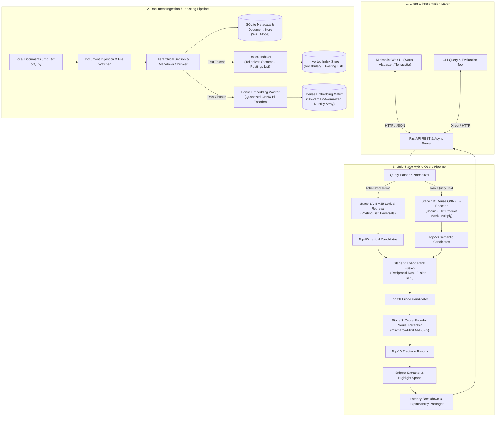

# System Architecture: Private Hybrid Neural Search Engine

**Project**: NeuralSearch  
**Path**: `D:\neural-search-engine\ARCHITECTURE.md`  
**Architecture Style**: Multi-Stage Cascade Retrieval & Reranking Architecture (Local-First)  

---

## 1. End-to-End System Architecture



---

## 2. Mathematical Formulations of the Search Pipeline

### 2.1 Lexical Search: Okapi BM25 Formulation
The relevance score of a document $D$ for query $Q = \{q_1, q_2, \dots, q_n\}$ is given by:

$$\text{Score}_{\text{BM25}}(D, Q) = \sum_{i=1}^{n} \text{IDF}(q_i) \cdot \frac{f(q_i, D) \cdot (k_1 + 1)}{f(q_i, D) + k_1 \cdot \left(1 - b + b \cdot \frac{|D|}{\text{avgdl}}\right)}$$

Where:
* $f(q_i, D)$ is the term frequency of query token $q_i$ in document $D$.
* $|D|$ is the length of document $D$ in words, and $\text{avgdl}$ is the average document length across the entire corpus.
* $k_1$ (default $1.5$) calibrates term frequency saturation limit.
* $b$ (default $0.75$) controls document length penalty normalization.
* $\text{IDF}(q_i)$ is the Inverse Document Frequency with smoothing:

$$\text{IDF}(q_i) = \ln\left(1 + \frac{N - n(q_i) + 0.5}{n(q_i) + 0.5}\right)$$

where $N$ is the total number of documents and $n(q_i)$ is the number of documents containing term $q_i$.

---

### 2.2 Dense Semantic Retrieval: Bi-Encoder Embeddings & Cosine Similarity
Given a query $Q$ and candidate chunk text $C_j$:
1. Embed query: $\mathbf{e}_Q = \text{ONNX\_BiEncoder}(Q) \in \mathbb{R}^{d}$ ($d = 384$).
2. Normalized vectors: $\hat{\mathbf{e}}_Q = \frac{\mathbf{e}_Q}{\|\mathbf{e}_Q\|_2}$ and $\hat{\mathbf{e}}_{C_j} = \frac{\mathbf{e}_{C_j}}{\|\mathbf{e}_{C_j}\|_2}$.
3. High-speed vector scoring via batched BLAS/SIMD dot product:

$$\text{Score}_{\text{Dense}}(Q, C_j) = \hat{\mathbf{e}}_Q \cdot \hat{\mathbf{e}}_{C_j} = \sum_{k=1}^{d} \hat{e}_{Q,k} \cdot \hat{e}_{C_j,k}$$

Because all chunk vectors in the index are pre-normalized upon ingestion, cosine similarity reduces to a single matrix-vector multiplication ($\mathbf{M}_{\text{index}} \mathbf{e}_Q$), completing across 50,000 chunks in **$<3$ milliseconds** on CPU.

---

### 2.3 Stage 2: Reciprocal Rank Fusion (RRF)
To merge candidates from disparate scoring distributions (BM25 scores $\in [0, \infty)$ vs Cosine scores $\in [-1, 1]$), we employ Reciprocal Rank Fusion:

$$\text{Score}_{\text{RRF}}(d) = \sum_{m \in \{\text{BM25}, \text{Dense}\}} \frac{w_m}{k + \text{rank}_m(d)}$$

Where:
* $k \approx 60$ is a smoothing constant that prevents top ranks from dominating disproportionately.
* $\text{rank}_m(d) \in \{1, 2, \dots, K\}$ is the 1-based ordinal position of document $d$ in system $m$.
* $w_m$ is an optional system weight (default: $w_{\text{BM25}} = 0.5$, $w_{\text{Dense}} = 0.5$).

---

### 2.4 Stage 3: Cross-Encoder Neural Reranking
While Bi-Encoders encode query and document independently (allowing pre-computation of vectors), a **Cross-Encoder** feeds both simultaneously into the transformer with joint cross-attention across all token pairs:

$$\mathbf{h} = \text{Transformer}(\text{[CLS]} \circ Q \circ \text{[SEP]} \circ D \circ \text{[SEP]})$$
$$\text{Score}_{\text{CE}}(Q, D) = \sigma(\mathbf{W} \cdot \mathbf{h}_{\text{[CLS]}} + b)$$

This captures deep semantic interactions, negation, exact prepositional relationships, and nuanced relevance that bi-encoders miss. We apply this only to the top 20 fused candidates to maintain total latency under 50ms.

---

## 3. Storage Layer & Database Schema

The persistent metadata layer runs on **SQLite** with Write-Ahead Logging (`WAL` mode) and memory-mapped I/O (`PRAGMA mmap_size = 268435456`):

```sql
-- Documents table
CREATE TABLE documents (
    id INTEGER PRIMARY KEY AUTOINCREMENT,
    file_path TEXT UNIQUE NOT NULL,
    file_name TEXT NOT NULL,
    file_hash TEXT NOT NULL,
    file_size INTEGER NOT NULL,
    mime_type TEXT NOT NULL,
    created_at TIMESTAMP DEFAULT CURRENT_TIMESTAMP,
    updated_at TIMESTAMP DEFAULT CURRENT_TIMESTAMP
);

-- Chunks table
CREATE TABLE chunks (
    id INTEGER PRIMARY KEY AUTOINCREMENT,
    document_id INTEGER NOT NULL REFERENCES documents(id) ON DELETE CASCADE,
    chunk_index INTEGER NOT NULL,
    content TEXT NOT NULL,
    token_count INTEGER NOT NULL,
    section_heading TEXT,
    start_line INTEGER,
    end_line INTEGER
);

-- Inverted Index Vocabulary
CREATE TABLE terms (
    term_id INTEGER PRIMARY KEY AUTOINCREMENT,
    term TEXT UNIQUE NOT NULL,
    doc_freq INTEGER NOT NULL DEFAULT 0
);

-- Posting Lists
CREATE TABLE postings (
    term_id INTEGER NOT NULL REFERENCES terms(term_id),
    chunk_id INTEGER NOT NULL REFERENCES chunks(id),
    term_freq INTEGER NOT NULL,
    positions TEXT, -- JSON array of token positions for exact phrase matching
    PRIMARY KEY (term_id, chunk_id)
);

CREATE INDEX idx_postings_term ON postings(term_id);
CREATE INDEX idx_chunks_doc ON chunks(document_id);
```

---

## 4. API Specification

| Method | Endpoint | Description |
| :--- | :--- | :--- |
| `POST` | `/api/index/file` | Ingest and index an individual file |
| `POST` | `/api/index/directory` | Recursively scan, chunk, and index a folder |
| `GET` | `/api/search` | Execute hybrid search with query `q`, mode `hybrid\|bm25\|dense`, `rerank=true\|false` |
| `GET` | `/api/explain/{chunk_id}` | Detailed score breakdown (BM25 term matches, vector cosine, cross-encoder score) |
| `GET` | `/api/stats` | System telemetry, corpus stats, chunk counts, vocabulary size |
| `GET` | `/api/health` | Service status and model readiness |
