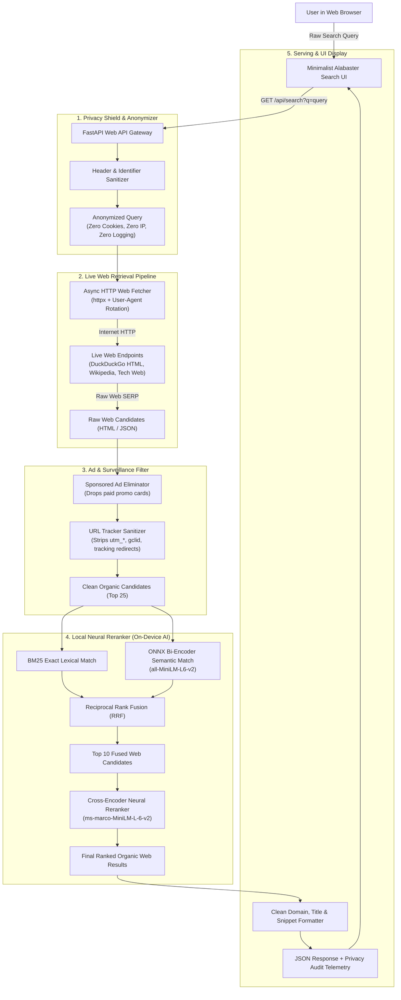

# System Architecture: Private, Ad-Free Neural Web Search Engine

**Project**: NeuralSearch  
**Path**: `D:\neural-search-engine\ARCHITECTURE.md`  
**Architecture Style**: Privacy-Preserving Metasearch & Neural Re-Ranking Pipeline  

---

## 1. End-to-End System Architecture

---

## 2. Core Subsystems

### 2.1 Privacy Shield & Header Scrubbing
To guarantee complete user anonymity, every outbound request from NeuralSearch to external web servers enforces:
1. **No User IP Forwarding**: Downstream search engines only see the IP of the machine making the request, never client identifiers or browser sessions.
2. **Referer & Cookie Stripping**: All `Cookie`, `Set-Cookie`, `Referer`, and tracking headers are completely removed.
3. **User-Agent Spoofing**: Rotates common desktop user-agents to prevent browser canvas/WebGL fingerprinting.

---

### 2.2 Web Search Fetcher (`web/fetcher.py`)
Queries live internet sources using lightweight, privacy-respecting endpoints:
* **DuckDuckGo Lite / HTML Engine**: Fetches live web results without JavaScript trackers or user cookies.
* **Wikipedia API**: Real-time factual direct-knowledge extraction for definition and entity queries.
* **Tech & Academic Fallback**: Specialized queries targeted at developer hubs (GitHub, StackOverflow, ArXiv).

---

### 2.3 Ad Filter & URL Tracker Sanitizer (`web/ad_blocker.py`)
Commercial search engines pollute search results with sponsored ads and surveillance redirects. NeuralSearch sanitizes all retrieved items:

#### URL Parameter Cleaning:
Removes invasive tracking query parameters via regex:
* Google Ads: `gclid`, `gclsrc`, `dclid`
* Facebook / Meta: `fbclid`
* Microsoft / Bing: `msclkid`
* Marketing / Analytics: `utm_source`, `utm_medium`, `utm_campaign`, `utm_term`, `utm_content`
* Affiliate & Referrals: `ref`, `affiliate_id`, `tag`

#### Direct URL De-referencing:
Replaces tracking redirect links (e.g. `google.com/url?q=https://example.com`) with clean, direct target URLs (`https://example.com`).

---

### 2.4 Local Neural Reranking Engine
Standard web search engines order links based on SEO keyword stuffing and advertiser revenue. NeuralSearch scores the retrieved web snippets locally using:
1. **Okapi BM25**: Verifies that user terms appear in the snippet or title.
2. **Quantized ONNX Bi-Encoder**: Evaluates semantic conceptual alignment between query and web content.
3. **Cross-Encoder Neural Reranker**: Performs joint attention across the query and web snippets to rank high-signal, authentic content in top positions.

---

## 3. Telemetry & Privacy Audit Metrics

Every search response provides a transparency report:
* `ads_blocked`: Number of sponsored ads filtered out.
* `trackers_stripped`: Count of tracking query parameters purged.
* `web_fetch_ms`: Time taken to retrieve live web results.
* `rerank_ms`: Time taken by the local neural model.
* `total_latency_ms`: Complete search round-trip time.
