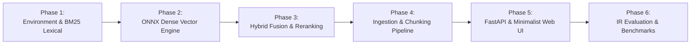

# Development Roadmap & Implementation Phases

**Project**: NeuralSearch (Private Hybrid Neural Search Engine)  
**Root**: `D:\neural-search-engine`  
**Execution Model**: Incremental, Test-Driven Phased Implementation  

---

## Phase Overview & Dependencies

---

## Phase 1: Environment & Lexical BM25 Engine from Scratch
* **Objective**: Build a mathematically verified, high-performance lexical search engine from fundamental principles.
* **Key Tasks**:
  - Initialize Python virtual environment using Python 3.11: `python -m venv .venv`.
  - Install dependencies: `numpy`, `fastapi`, `uvicorn`, `onnxruntime`, `tokenizers`, `pydantic`, `pytest`.
  - Implement custom `Tokenizer`: lowercasing, regex word boundaries, stopword removal, and Porter stemmer.
  - Implement `InvertedIndex`: term dictionaries, document frequency, posting lists with term frequencies and positions.
  - Implement `Okapi BM25` ranker with length normalization ($k_1=1.5, b=0.75$).
* **Verification & Tests**:
  - `tests/test_tokenizer.py`: Test normalization, stemming, and edge cases.
  - `tests/test_bm25.py`: Test BM25 score monotonicity (higher term frequency yields higher score; document length penalties).

---

## Phase 2: Dense Semantic Retrieval & Quantized ONNX Bi-Encoder
* **Objective**: Implement sub-15ms local neural text embeddings on CPU using ONNX Runtime.
* **Key Tasks**:
  - Set up model loader for quantized `all-MiniLM-L6-v2` ONNX model.
  - Implement `DenseEncoder`: Batched inference, mean pooling, and L2 vector normalization.
  - Implement `VectorIndex`: In-memory 384-dimensional float32 matrix with SIMD dot product matrix multiplication.
  - Benchmark vector retrieval latency across 10,000 synthetic vectors ($<3\text{ms}$).
* **Verification & Tests**:
  - `tests/test_encoder.py`: Verify cosine similarity yields $>0.85$ on semantic paraphrases and $<0.2$ on unrelated concepts.
  - `tests/test_vector_index.py`: Verify top-$K$ vector matches against exact brute-force search.

---

## Phase 3: Multi-Stage Hybrid Fusion & Cross-Encoder Reranker
* **Objective**: Fuse lexical and dense candidates into a unified rank list and apply neural reranking.
* **Key Tasks**:
  - Implement `ReciprocalRankFusion` (RRF) with constant $k=60$.
  - Implement `RelativeScoreFusion` (RSF) with min-max score normalization and weighted parameter $\alpha$.
  - Implement `CrossEncoderReranker`: Joint token attention scoring (`ms-marco-MiniLM-L-6-v2`) on top 20 candidates.
  - Build candidate pipeline combining Stage 1A (Top-50 BM25) + Stage 1B (Top-50 Dense) $\rightarrow$ Stage 2 (Top-20 Fused) $\rightarrow$ Stage 3 (Top-10 Reranked).
* **Verification & Tests**:
  - `tests/test_fusion.py`: Test mathematical properties of RRF and weight tuning.
  - `tests/test_hybrid_pipeline.py`: Verify hybrid queries catch both keyword exact matches and conceptual synonyms.

---

## Phase 4: Document Ingestion, Hierarchical Chunking & SQLite Store
* **Objective**: Build an incremental ingestion engine that parses markdown, code, and text into contextual chunks.
* **Key Tasks**:
  - Implement `MarkdownChunker`: Header-aware chunking (H1/H2 boundaries, code block preservation, token overlap).
  - Implement `SQLiteStore`: WAL-mode database storing documents, chunks, hashes, and postings.
  - Implement incremental indexing: File hashing (`SHA256`) to skip unchanged files and re-index modified files.
  - Build CLI interface: `python -m neuralsearch index <path>` and `python -m neuralsearch search "<query>"`.
* **Verification & Tests**:
  - `tests/test_chunking.py`: Verify code blocks are never cut in half and heading hierarchy is preserved in metadata.
  - `tests/test_storage.py`: Test SQLite schema migrations, indexing, and crash recovery.

---

## Phase 5: FastAPI Backend & Light Minimalist Web UI
* **Objective**: Deliver an ultra-fast REST API and the light minimalist user interface.
* **Key Tasks**:
  - Implement FastAPI endpoints: `/api/search`, `/api/index`, `/api/explain`, `/api/stats`, `/api/health`.
  - Embed the **Warm Alabaster & Terracotta** UI directly into the application (`#FCF2E5`, `#524646`, `#A8A492`, `#EC5B38`).
  - Implement search-as-you-type with debounced requests.
  - Build dynamic snippet extractor with keyword and semantic match highlighting.
  - Add latency waterfall bar and "Under-the-Hood" Explainability Drawer.
* **Verification & Tests**:
  - `tests/test_api.py`: Verify endpoint response times, query validation, and JSON schemas.
  - Manual UI verification in browser: Test keyboard shortcuts, snippet highlighting, and responsiveness.

---

## Phase 6: Quantitative IR Evaluation Suite & Benchmarking (Resume Supercharger)
* **Objective**: Provide undeniable empirical proof of retrieval quality and latency to showcase in interviews.
* **Key Tasks**:
  - Create a curated evaluation benchmark dataset (queries with ground-truth relevant chunks).
  - Implement automated IR metrics:
    - **NDCG@10** (Normalized Discounted Cumulative Gain)
    - **MRR** (Mean Reciprocal Rank)
    - **Precision@K** and **Recall@K**
  - Generate an automated comparison report:
    `BM25 Only` vs `Dense Only` vs `Hybrid RRF` vs `Hybrid + Cross-Encoder`.
  - Write a comprehensive production `README.md` complete with architecture diagrams, installation instructions, and resume bullet points.
* **Verification & Tests**:
  - Run `python -m neuralsearch evaluate` and verify all metric calculations.
