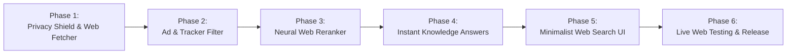

# Implementation Phases: Private, Ad-Free Neural Web Search Engine

**Project**: NeuralSearch (Web Edition)  
**Root**: `D:\neural-search-engine`  

---

## Phase Roadmap

---

## Phase 1: Privacy Shield & Anonymized Web Fetcher
* Implement `src/neuralsearch/web/fetcher.py`:
  - Async HTTP client with `httpx` to query live web endpoints (DuckDuckGo Lite / HTML and open search protocols).
  - Anonymization layer: drops client IPs, cookies, and rotates user-agent headers.
  - HTML parser extracting web titles, clean destination URLs, and meta snippets.

## Phase 2: Anti-Ad & Tracker Sanitizer
* Implement `src/neuralsearch/web/ad_blocker.py`:
  - Identifies and drops sponsored search advertisements and paid partner slots.
  - Purges tracking query parameters (`utm_*`, `gclid`, `fbclid`, `msclkid`, affiliate tags).
  - Decodes tracking redirect hops to deliver direct destination URLs.

## Phase 3: Local Neural Web Reranking Engine
* Connect web search candidates to `src/neuralsearch/core/reranker.py` and `src/neuralsearch/core/dense_encoder.py`:
  - Re-evaluates fetched web snippets using on-device AI.
  - Punishes clickbait and SEO keyword stuffing by computing semantic similarity between user query and actual web snippet content.

## Phase 4: Instant Knowledge & Wikipedia Synthesis
* Implement instant factual answers for definition, entity, and concept queries by fetching canonical summaries directly from Wikipedia / Wikidata APIs.

## Phase 5: Light Minimalist Web Search UI
* Update `src/neuralsearch/ui/index.html`:
  - Search categories (`All Web`, `Tech & Code`, `News`).
  - Privacy Shield live telemetry bar (showing ads blocked and trackers stripped).
  - External web result cards with favicons, domain breadcrumbs, and direct outbound links.

## Phase 6: Live Web Testing & Verification
* Run live internet search tests across technology queries, news topics, and concept definitions.
* Update `README.md` and push all updates to GitHub.
