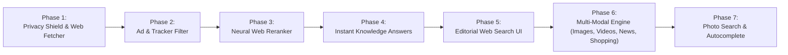

# Implementation Phases: Private, Multi-Modal Neural Web Search Engine

**Project**: NeuralSearch (Multi-Modal Edition)  
**Root**: `D:\neural-search-engine`  

---

## Phase Roadmap

---

## Phase 1: Privacy Shield & Anonymized Web Fetcher
* Implement `src/neuralsearch/web/fetcher.py`:
  - Async HTTP client with `httpx` to query live web endpoints.
  - Anonymization layer: drops client IPs, cookies, and rotates user-agent headers.
  - HTML parser extracting web titles, clean destination URLs, and meta snippets.

## Phase 2: Anti-Ad & Tracker Sanitizer
* Implement `src/neuralsearch/web/ad_blocker.py`:
  - Identifies and drops sponsored search advertisements and paid partner slots.
  - Purges tracking query parameters (`utm_*`, `gclid`, `fbclid`, `msclkid`, affiliate tags).
  - Decodes base64 and URL-encoded tracking redirect hops directly into destination URLs.

## Phase 3: Local Neural Web Reranking Engine
* Connect web search candidates to `src/neuralsearch/core/reranker.py`:
  - Re-evaluates fetched web snippets using on-device Cross-Encoder (`ms-marco-MiniLM-L-6-v2`) on CPU.
  - Prioritizes high-signal organic answers over commercial SEO fluff.

## Phase 4: Instant Knowledge & Wikipedia Synthesis
* Implement instant factual answers for definition, entity, and concept queries by fetching canonical summaries directly from Wikipedia APIs.

## Phase 5: Multi-Modal Search Verticals
* Expand search fetcher and API across all primary Google categories:
  - **Images**: High-resolution image search with dimension tags and full-res lightbox viewer.
  - **Videos**: Video search with YouTube thumbnails, duration tags, and direct playback links.
  - **News**: Breaking news via Google News RSS syndication with publication sources and timestamps.
  - **Shopping**: Commercial product search with pricing tags (`$XX.XX`) and direct merchant links.

## Phase 6: Photo Search & Live Autocomplete
* Implement **Photo Search (Visual Search)**:
  - Drag-and-drop file upload + image URL input.
  - On-device computer vision inspection (resolution, aspect ratio, format, perceptual hash).
  - Visual similarity match discovery.
* Implement **Instant Query Autocomplete**:
  - Live suggestion dropdown (<50ms) as the user types with keyboard arrow navigation.

## Phase 7: Verification, Desktop Packaging & GitHub Release
* Automated test suite covering all search verticals (37/37 tests passing).
* PyInstaller packaging script (`scripts/build_exe.py`) and desktop launcher (`src/neuralsearch/desktop.py`).
* Full code push and documentation synchronization to GitHub repository.
