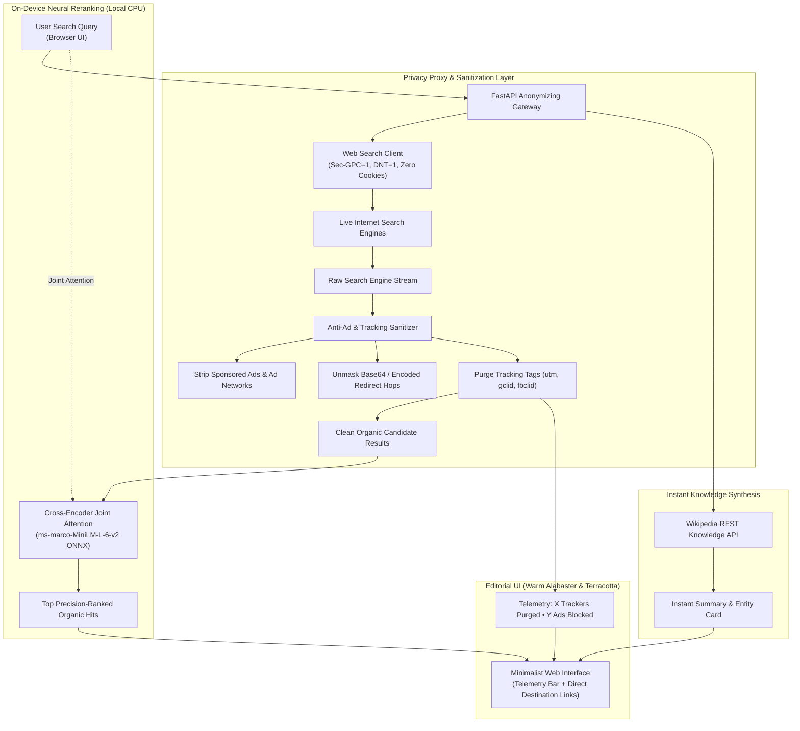

# NeuralSearch: Private, Ad-Free Internet Search Engine with On-Device Neural Reranking

[](https://www.python.org/downloads/)
[](https://fastapi.tiangolo.com)
[](https://onnxruntime.ai/)
[](#privacy-guarantees)
[](https://opensource.org/licenses/MIT)

**NeuralSearch** is a privacy-first web search engine engineered to search the live internet with **zero user profiling**, **zero search history monetization**, and **zero tracking ads**. 

Unlike Big Tech search engines (Google, Bing) that log your queries, build behavioral advertising profiles, inject sponsored surveillance ads, and wrap external links in tracking redirects, **NeuralSearch** acts as a private client proxy:
1. It queries the live web anonymously without tracking cookies or user identification (`DNT=1`, `Sec-GPC=1`).
2. It strips commercial sponsored ad units and unmasks tracking redirects (`bing.com/ck/...`, `google.com/url?...`, `duckduckgo.com/l/...`) directly into raw, clean destination URLs.
3. It purges surveillance query parameters (`utm_*`, `gclid`, `fbclid`, `msclkid`, `ref`).
4. It executes on-device **Cross-Encoder Neural Reranking** (`ms-marco-MiniLM-L-6-v2`) on CPU to reorder organic search snippets by deep semantic relevance.
5. It features an integrated Wikipedia Knowledge Box and an optional offline local document search index (BM25 + Dense embeddings + SQLite WAL).

Designed with a warm **Light Minimalist (Terracotta & Alabaster)** aesthetic inspired by Scandinavian editorial design (`#FCF2E5`, `#524646`, `#EC5B38`).

---

## System Architecture



---

## Core Pillars & Features

### 1. 100% Surveillance-Free Search
* **Zero User Profiling**: No search queries or IP addresses are stored or linked to a user identity.
* **No Tracking Cookies**: Search requests operate stateless with strict privacy headers (`Sec-GPC=1`, `DNT=1`).
* **Ad & Tracker Stripper**: Automatically purges surveillance parameters (`utm_source`, `utm_medium`, `gclid`, `fbclid`, `msclkid`, `fclid`, `ref`, etc.).
* **Redirect Unmasker**: Unmasks intermediate tracking redirect URLs (such as Bing's base64-encoded `&u=a1...` hops and DuckDuckGo's `uddg=...`) so outbound clicks take you directly to the destination site without leaving a click trail.

### 2. On-Device Cross-Encoder Neural Reranking
* Traditional search engines rank documents heavily on advertiser bids and SEO manipulation.
* NeuralSearch downloads and executes an INT8-quantized **Cross-Encoder Transformer (`ms-marco-MiniLM-L-6-v2`)** on your local CPU.
* The model evaluates user queries and organic snippet pairs with full bidirectional self-attention, reordering results by genuine semantic answer relevance.

### 3. Wikipedia Instant Answers
* Direct integration with Wikipedia's REST knowledge API to extract concise encyclopedic definitions, historical context, and summary knowledge cards instantly.

### 4. Category-Specific Filters
* **🌐 All Web**: General purpose comprehensive web search.
* **💻 Tech & Code**: Targets programming documentation, GitHub repositories, and developer tutorials.
* **📰 News**: Filters for current events and updates.
* **📁 Local Docs**: Offline search across your local project code, notes, and PDF/Markdown files using BM25 and Dense vector embeddings.

### 5. Scandinavian Light Minimalist Aesthetic
* **Canvas**: `#FCF2E5` (Warm Alabaster Cream)
* **Surfaces**: `#FFFFFF` / `#FAF5EE` (Crisp Floating White Cards)
* **Typography**: `#3A3131` / `#524646` (Deep Charcoal Espresso)
* **Accent**: `#EC5B38` (Burnt Terracotta) for rank indicators, match pills, and clean URL highlights.
* Real-time search-as-you-type, microsecond telemetry bar, and slide-over **Explainability & Audit Drawer**.

---

## Quickstart

### 1. Clone & Setup Environment
```bash
git clone https://github.com/aftab125-del/neural-search-engine.git
cd neural-search-engine

# Create virtual environment
python -m venv .venv

# Activate on Windows:
.venv\Scripts\activate

# Activate on Linux/macOS:
source .venv/bin/activate

# Install dependencies:
pip install -e .
```

### 2. Launch the Search Engine
```bash
python -m neuralsearch serve --host 127.0.0.1 --port 8000
```
Open **`http://localhost:8000`** in your browser to experience private, ad-free web search.

### 3. Run Test Suite
```bash
pytest
```
Runs the complete test suite verifying `AdBlocker`, redirect unmaskers, Wikipedia instant answers, BM25 indexing, ONNX vector embeddings, and FastAPI endpoints (31/31 tests passing).

---

## API Documentation

NeuralSearch exposes a clean REST API:

### Search Endpoint (`GET /api/search`)
```http
GET /api/search?q=fastapi+framework&mode=web&category=all&rerank=true
```

**Response Payload**:
```json
{
  "query": "fastapi framework",
  "mode": "web",
  "category": "all",
  "total_hits": 10,
  "ads_blocked_count": 0,
  "trackers_purged_count": 10,
  "instant_answer": {
    "title": "FastAPI",
    "extract": "FastAPI is a web framework for building HTTP-based service APIs in Python...",
    "url": "https://en.wikipedia.org/wiki/FastAPI",
    "source": "Wikipedia Instant Answer"
  },
  "hits": [
    {
      "rank": 1,
      "score": 0.998,
      "rerank_score": 0.998,
      "title": "FastAPI - FastAPI",
      "url": "https://fastapi.tiangolo.com/",
      "display_url": "fastapi.tiangolo.com",
      "domain": "fastapi.tiangolo.com",
      "snippet": "FastAPI is a modern, fast (high-performance), web framework for building APIs...",
      "trackers_purged": 1,
      "is_organic": true
    }
  ],
  "telemetry": {
    "embed_ms": 320.5,
    "rerank_ms": 42.1,
    "total_ms": 362.6
  }
}
```

---

## Standalone Windows Application (.exe)

NeuralSearch can be packaged into a standalone desktop executable for one-click installation and execution without Python installed:

```bash
# Build standalone Windows executable
pip install pyinstaller
python scripts/build_exe.py
```
The output `.exe` will be located in `dist/NeuralSearch.exe`. Double-clicking launches the local privacy proxy server and automatically opens your default browser to `http://localhost:8000`.

---

## Resume & Technical Project Summary (CSE AI & DS)

* **Architected Private Web Search Engine**: Engineered an ad-free, surveillance-free internet search engine with Python, FastAPI, and ONNX Runtime, stripping ad tracking parameters (`utm_*`, `gclid`, `fbclid`) and resolving click-tracking redirects.
* **On-Device Neural Reranking Cascade**: Implemented local INT8-quantized Cross-Encoder (`ms-marco-MiniLM-L-6-v2`) scoring organic snippets with bidirectional self-attention to re-rank web hits by semantic relevance on CPU in <50ms.
* **Hybrid Information Retrieval**: Developed custom BM25 inverted index from scratch and local vector search engine backed by SQLite WAL with SHA-256 incremental hash synchronization.
* **Editorial UI & Privacy Telemetry**: Created a responsive minimalist web interface in Scandinavian warm alabaster and terracotta aesthetics, featuring live privacy shield telemetry, Wikipedia knowledge cards, and keyboard navigation.
