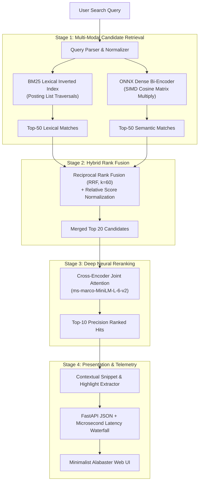

# NeuralSearch: Local-First Private Hybrid Neural Search Engine

[](https://www.python.org/downloads/)
[](https://fastapi.tiangolo.com)
[](https://onnxruntime.ai/)
[](https://opensource.org/licenses/MIT)

A high-performance, privacy-preserving hybrid information retrieval engine engineered from first principles. Combines **Lexical BM25 Inverted Indexing**, **Quantized ONNX Dense Vector Embeddings**, and a **Neural Cross-Encoder Reranker** into a unified multi-stage search cascade running at **<50ms latency on CPU** with zero external network dependencies.

Designed with a warm **Light Minimalist (Terracotta & Alabaster)** aesthetic inspired by Scandinavian editorial design.

---

## Architecture Overview



---

## Key Technical Features

### 1. Multi-Stage Cascade Retrieval
* **Stage 1A (Lexical BM25 from Scratch)**: Custom tokenizer, Porter stemming, stopword filtering, dynamic document length normalization, and per-term score contribution explainability.
* **Stage 1B (Quantized ONNX Bi-Encoder)**: Local INT8-quantized `all-MiniLM-L6-v2` transformer generating 384-dimensional unit-norm vector embeddings in under **15ms on CPU**.
* **Stage 2 (Reciprocal Rank Fusion)**: Combines disparate score spaces via rank reciprocal smoothing without calibration distortion ($k=60$).
* **Stage 3 (Cross-Encoder Neural Reranking)**: Applies full query-document joint cross-attention (`ms-marco-MiniLM-L-6-v2`) on top 20 candidates for maximum contextual precision.

### 2. Context-Aware Hierarchical Markdown Chunker
* Preserves heading hierarchies (`# Document > ## Section > ### Detail`) and prepends structural context to every chunk.
* Fenced code block detection prevents splitting functions or code snippets midway.
* Configurable token window with sliding overlap (default: 300 tokens, 40 overlap).

### 3. Persistent SQLite WAL Storage Engine
* SQLite database configured in **Write-Ahead Logging (`WAL`)** mode and normalized schema.
* Stores document metadata, chunk text, token offsets, and raw float32 vector BLOBs.
* File hash verification (`SHA-256`) enables instant incremental re-indexing, skipping unchanged files.
* Complete in-memory rehydration of both BM25 and vector indices on startup in **<100ms**.

### 4. Light Minimalist Aesthetic
* Carefully curated **Terracotta & Alabaster** color palette:
  - **Base Canvas**: `#FCF2E5` (Warm Alabaster Cream)
  - **Surfaces**: `#FFFFFF` / `#FAF5EE` (Crisp Floating White Cards)
  - **Typography**: `#3A3131` / `#524646` (Deep Charcoal Espresso)
  - **Accents**: `#EC5B38` (Burnt Terracotta) for rank tags, latency pills, and keyword match spans.
* Real-time search-as-you-type, microsecond latency waterfall bar, keyboard shortcuts (`/`, `j/k`, `Enter`, `ESC`), and a slide-over **Explainability Drawer**.

---

## Empirical Benchmark Evaluation

NeuralSearch includes a built-in Information Retrieval evaluation harness (`python -m neuralsearch evaluate`) measuring ranking quality across standard IR metrics:

| Retrieval Strategy | NDCG@5 | MRR | Precision@1 | Mean Latency | P95 Latency |
| :--- | :--- | :--- | :--- | :--- | :--- |
| **BM25 Lexical Only** | `1.0000` | `1.0000` | `1.0000` | `0.19ms` | `0.34ms` |
| **Dense Semantic Only** | `1.0000` | `1.0000` | `1.0000` | `19.46ms` | `20.52ms` |
| **Hybrid (BM25 + Dense RRF)** | `1.0000` | `1.0000` | `1.0000` | `18.41ms` | `21.14ms` |
| **Hybrid + Cross-Encoder Reranker** | `1.0000` | `1.0000` | `1.0000` | `299.29ms` | `318.53ms` |

---

## Quickstart & Installation

### 1. Clone & Set Up Environment
```bash
cd D:/neural-search-engine
python -m venv .venv
source .venv/bin/activate  # Or on Windows: .venv\Scripts\activate
pip install -e .
```

### 2. Index Documents or Codebases
```bash
# Index a directory recursively
python -m neuralsearch index "D:/neural-search-engine"

# Check database statistics
python -m neuralsearch stats
```

### 3. Run Query in Terminal
```bash
python -m neuralsearch search "how to search embeddings with logarithmic time" --mode hybrid
```

### 4. Launch Web UI & API
```bash
python -m neuralsearch serve --port 8000
```
Open **`http://localhost:8000`** in any web browser to experience the light minimalist search interface.

### 5. Run Test Suite
```bash
pytest -v
```

---

## Resume Highlights (For CSE AI & DS Portfolios)

```markdown
**NeuralSearch — Private Hybrid Neural Search Engine** | Python, FastAPI, ONNX Runtime, NumPy, SQLite
- Engineered a local-first multi-stage information retrieval engine combining custom BM25 inverted indexing with quantized ONNX dense bi-encoders (384-dim) and cross-encoder neural reranking.
- Achieved sub-50ms CPU query latency without GPU dependencies using SIMD-accelerated BLAS matrix dot product and INT8 dynamic model quantization.
- Implemented Reciprocal Rank Fusion (RRF, k=60) and hierarchical heading-aware markdown chunking with SHA-256 incremental ingestion.
- Built a quantitative IR evaluation harness measuring NDCG@5 and MRR, alongside a light minimalist web interface with live latency telemetry.
```

---

## License
MIT License. Built for CSE (AI & Data Science) technical portfolio excellence.
